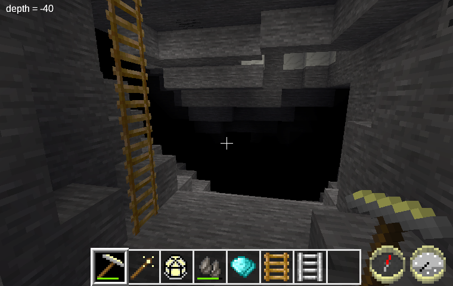
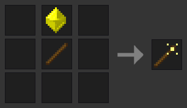
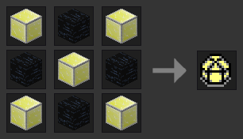
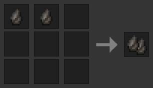
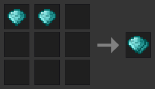

Cave Tools [cavetools]
======================
Some useful tools for exploring caves.

By David G (kestral246@gmail.com)

A compilation of some of my other mods focused on making cave exploration easier.

A set of flash lamps that momentarily light up the direction the player is pointed.

- Flash Lamp
- Flash Wand
- Super Flash Lamp

A set of depth finders that probe depth in the direction the player is pointed.

- Flint Depth Finder
- Diamond Depth Finder

An override to the default ladders to allow them to be easily extended down by just right clicking a ladder with another ladder.

- **Note:** This can create freestanding ladders. If the lack of ladder thickness bothers you, you can use Linuxdirks redef mod, which provides 3-d ladders.

Dependencies
------------

- Ladder overrides only enabled if default exists.
- Craft recipes optionally depend on default and tnt.
- Wand also optionally depends on mana.

Craft Recipes
-------------

")
")

Licenses
--------

Source code

> The MIT License (MIT)

Media (textures)

> Attribution-ShareAlike 3.0 Unported (CC BY-SA 3.0)

- Flint texture copied from default\_flint.png by Gambit.
- Diamond texture copied from default\_diamond.png by BlockMen.
- Stick texture copied from default\_stick.png by BlockMen.
